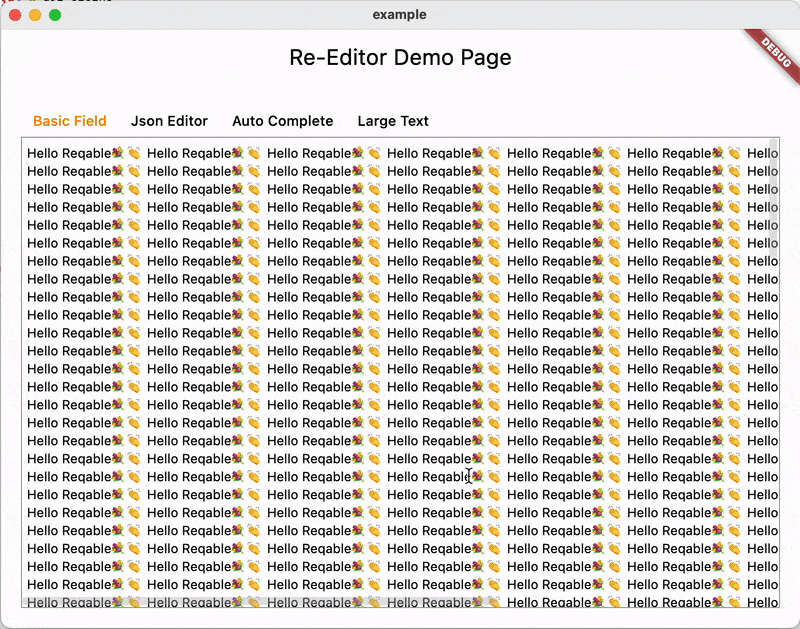

# Re-Editor

[](https://pub.dev/packages/re_editor)

[中文版本](./README_CN.md)

`Re-Editor` is a powerful lightweight text and code editor widget and a module in the [Reqable](https://reqable.com) project. It can be used as a simple text area or to develop a code editor with complex functions. Unlike Flutter's default `TextField`, `Re-Editor` is specifically tailored for the display and input of multi-line text and offers the following features:

- Two-way horizontal and vertical scrolling.
- Text syntax highlighting.
- Content collapsing and expanding.
- Input hints and auto-completion.
- Search and replace.
- Custom context menu builder.
- Shortcut keys.
- Large text display and editing.
- Line numbers and focus line builder.
- Smart input.

`Re-Editor` is not a secondary encapsulation based on `TextField`, but independently implements the layout, drawing, event processing, etc. It is specifically optimized for large texts, providing extremely high performance and fixed some issues of `TextField`.

`Re-Editor` offers a high degree of freedom. For example, developers can control whether to enable horizontal scrolling (word wrap), enable read-only mode, display line numbers, display content folding, define custom shortcut keys, and specify text syntax highlighting.

You can run the `example` project to experience it.



## Getting Started

Add the followings in `pubspec.yaml`.

```yaml
dependencies:
  re_editor: ^0.8.0
```

Like `TextField`, `Re-Editor` uses `CodeLineEditingController` as the controller. The following sample code creates the simplest multi-line input area, which is not much different from `TextField`.

```dart
Widget build(BuildContext context) {
  return CodeEditor(
    controller: CodeLineEditingController.fromText('Hello Reqable'),
  );
}
```

### Text Syntax Highlighting

The text highlighting of `Re-Editor` is based on [Re-Highlight](https://github.com/reqable/re-highlight) and supports nearly a hundred languages ​​and theme styles. Developers can freely choose and configure the code Highlight. The following code specifies the `JSON` syntax highlighting rules and applies the `Atom One Light` code coloring.

```dart
CodeEditor(
  style: CodeEditorStyle(
    codeTheme: CodeHighlightTheme(
      languages: {
        'json': CodeHighlightThemeMode(
          mode: langJson
        )
      },
      theme: atomOneLightTheme
    ),
  ),
);
```

### Line Numbers and Fold/Unfold Markers

`Re-Editor` supports configuring whether to display code line numbers and code folding marks, and developers can also implement display styles and layouts by themselves. The example code below shows the default style, built with `indicatorBuilder`.

```dart
CodeEditor(
  indicatorBuilder: (context, editingController, chunkController, notifier) {
    return Row(
      children: [
        DefaultCodeLineNumber(
          controller: editingController,
          notifier: notifier,
        ),
        DefaultCodeChunkIndicator(
          width: 20,
          controller: chunkController,
          notifier: notifier
        )
      ],
    );
  },
);
```

### Code Folding and Unfolding Detection

By default, `Re-Editor` will automatically detect the folding areas of `{}` and `[]`. Developers can control whether to detect or write their own detection rules. `DefaultCodeChunkAnalyzer` is the default detector. If you wish to disable detection, you can use `NonCodeChunkAnalyzer`.

```dart
CodeEditor(
  chunkAnalyzer: DefaultCodeChunkAnalyzer(),
);
```

If you want to customize it, just implement the `CodeChunkAnalyzer` interface.

```dart
abstract class CodeChunkAnalyzer {

  List<CodeChunk> run(CodeLines codeLines);

}
```

### Scroll Control

`Re-Editor` supports two-way scrolling, so two `ScrollController` are used, and developers can use `CodeScrollController` to construct.

```dart
CodeEditor(
  scrollController: CodeScrollController(
    verticalScroller: ScrollController(),
    horizontalScroller: ScrollController(),
  )
);
```

### Find and Replace

`Re-Editor` implements search and replace control logic, but does not provide a default UI. Developers need to write the UI of the search panel according to the actual situation of their own projects, and use the `findBuilder` attribute to set up their own search and replace UI.

```dart
CodeEditor(
  findBuilder: (context, controller, readOnly) => CodeFindPanelView(controller: controller, readOnly: readOnly),
);
```

The `CodeFindPanelView` in the above example is implemented by the developer himself. For the detailed implementation process, please refer to the code in `example`.

### Context Menu

`Re-Editor` implements the control logic of the desktop context menu and the mobile long-press selection menu, but does not provide a default UI. Developers need to implement the `SelectionToolbarController` interface and setup it through `toolbarController`.

```dart
CodeEditor(
  toolbarController: _MyToolbarController(),
);
```

### Shortcuts

`Re-Editor` has the built-in default shortcut hotkeys, and developers can also use `shortcutsActivatorsBuilder` to set custom shortcut hotkeys. Of course, the shortcut keys only work on the desktop.

The shortcut keys supported by `Re-Editor` are as follows:
- Select all (Control/Command + A)
- Cut selected/current line (Control/Command + V)
- Copy selected/current line (Control/Command + C)
- Paste (Control/Command + V)
- Undo (Control/Command + Z)
- Redo (Shift + Control/Command + Z)
- Select the current line (Control/Command + L)
- Delete current line (Control/Command + D)
- Move current line (Alt + ↑/↓)
- Continuous selection (Shift + ↑/↓/←/→)
- Move cursor (↑/↓/←/→)
- Move cursor between word boundaries (Alt + ←/→)
- Move to top/bottom of page (Control/Command + ↑/↓)
- Indent (Tab)
- Unindent (Shift + Tab)
- Comment/uncomment a single line (Control/Command + /)
- Comment/uncomment multiple lines (Shift + Control/Command + /)
- Character transpose (Control/Command + T)
- Search (Control/Command + F)
- Replace (Alt + Control/Command + F)
- Save (Control/Command + S)

### Code Hints and Auto-Completion

`Re-Editor` supports using the `CodeAutocomplete` widget to implement code input prompts and automatic completion. `Re-Editor` implements basic control logic, but the code prompt content, auto-completion rules and display UI need to be defined by the developer.

```dart
CodeAutocomplete(
  viewBuilder: (context, notifier, onSelected) {
    // build the code prompts view
  },
  promptsBuilder: DefaultCodeAutocompletePromptsBuilder(
    language: langDart,
  ),
  child: CodeEditor()
);
```

Note that `Re-Editor` is only a lightweight editor and does not have the IDE dynamic syntax analysis, so the code prompts and completion have many limitations. You can refer to the code in `example` to implement a simple code prompt and completion.

## Used By

`Re-Editor` has been extensively practiced in the Reqable project. You are welcome to download [Reqable](https://reqable.com/download) to experience it.


## License

MIT License

## Sponsor

If you would like to sponsor this project, you can support us by purchasing a [Reqable](https://reqable.com/pricing) license.
